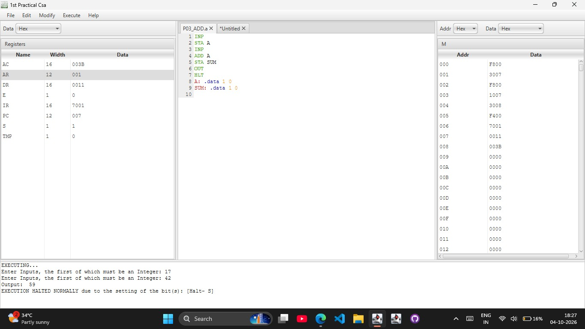
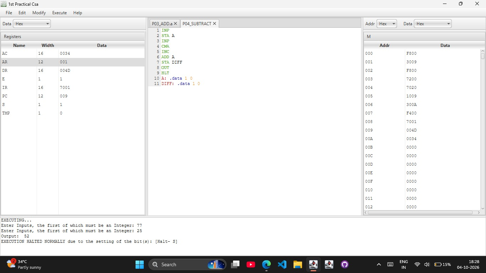
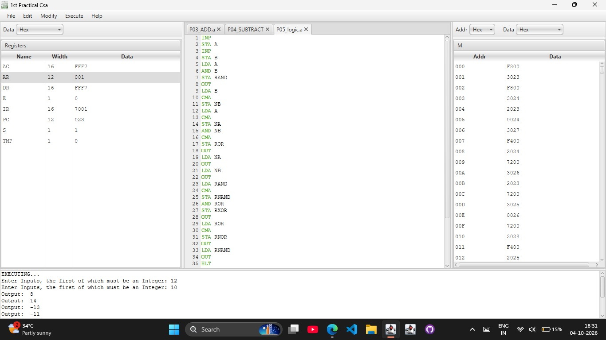
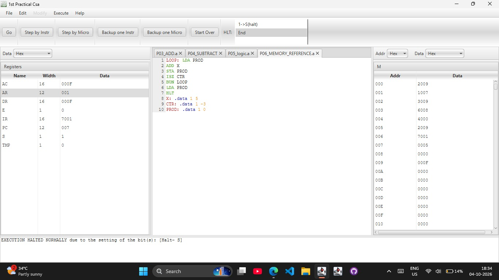
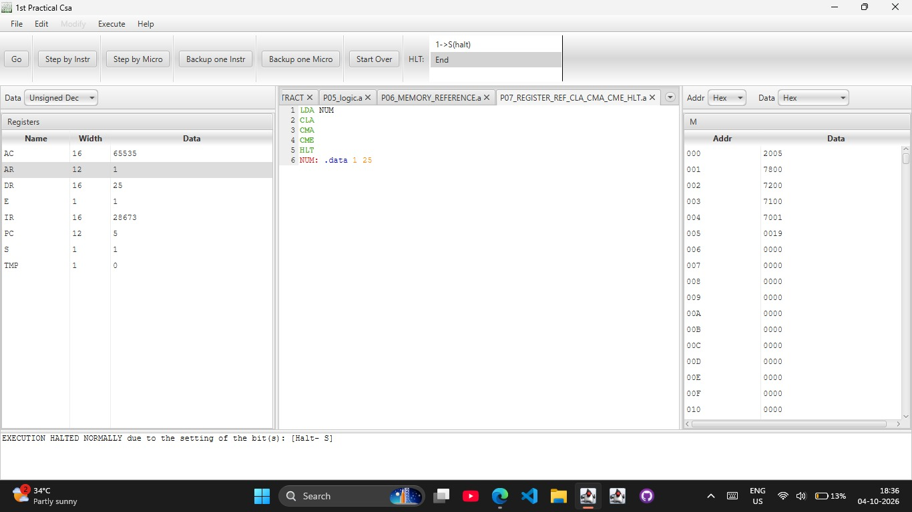
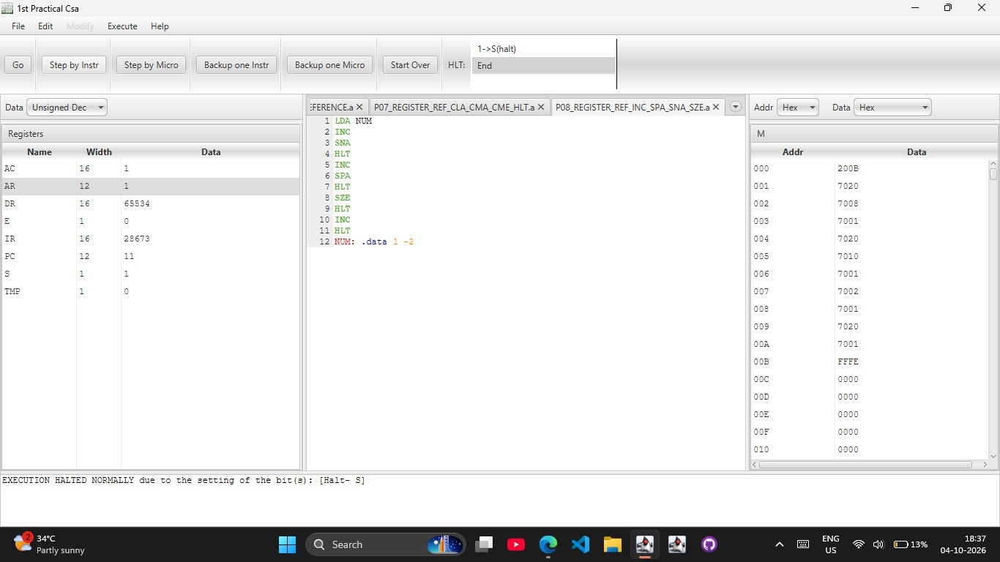
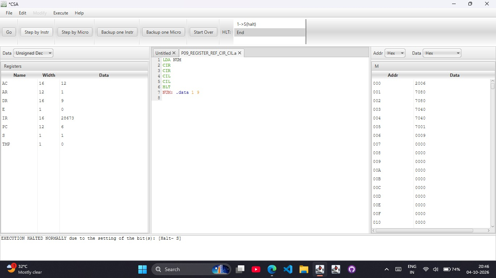
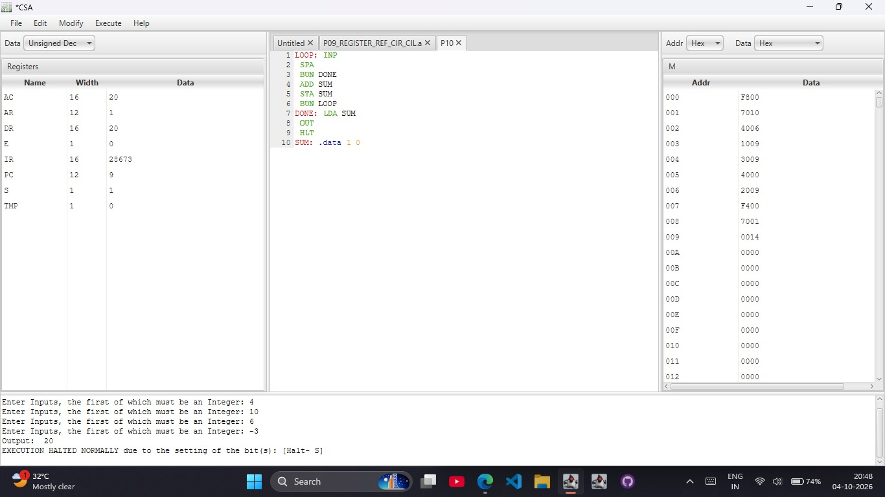
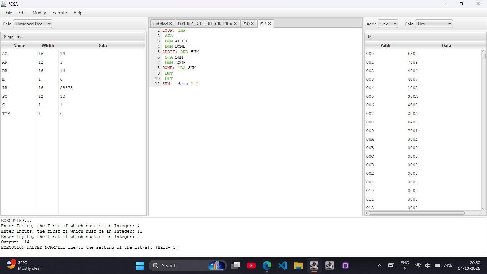

# CSA Practicals (CPU Sim 4)

Computer System Architecture practicals written in assembly and run on a Mano-style basic computer in **CPU Sim 4**. Each practical below has the aim, the code, the screenshot of the run, and the observed result. The same code is also kept as separate `.a` files in this repo, and the machine file is [`CSA.cpu`](CSA.cpu) (summary in [`CSA_machine.txt`](CSA_machine.txt)).

## Repo layout

All files are in one folder:

```
README.md
CSA.cpu              # CPU Sim 4 machine file (fixed)
CSA_original.cpu     # machine file before the fixes
CSA_machine.txt      # text summary: registers, RAM, instruction encodings
P03_ADD.a ... P11.a  # one .a file per practical
P03_ADD.jpg ... P11.jpg   # simulator screenshots
```

## Notes

**Machine.** 1 RAM (`M`) and 8 registers: `AC` (16), `AR` (12), `DR` (16), `E` (1), `IR` (16), `PC` (12), `S` (1), `TMP` (1). `S` is the halt bit; `HLT` sets it and the run stops.

**Instruction types.**

| Type | Instructions | Encoding |
|---|---|---|
| Memory reference | AND, ADD, LDA, STA, BUN, ISZ | opcode digit `0 1 2 3 4 6` + 12-bit address |
| Register reference | CLA, CLE, CMA, CME, CIR, CIL, INC, SPA, SNA, SZA, SZE, HLT | `7xxx` (e.g. CLA = 7800, HLT = 7001) |
| Input / Output | INP, OUT | `F800`, `F400` |

**Assembler.** `LABEL: .data 1 value` reserves one word holding `value`. `INP` reads a number into `AC`, `OUT` prints `AC`.

**Useful tricks used in these programs.**
- Subtraction: `A - B` = `A + (~B + 1)`, so `CMA` then `INC` gives the 2's complement of B.
- `ISZ` increments a memory word and skips the next instruction when it becomes 0, which makes a loop counter.
- `SPA` / `SNA` / `SZA` / `SZE` skip the next instruction if AC is positive / negative / zero, or E is zero.

---

## P03 - Addition

**Aim:** Read two numbers and print their sum.

```asm
INP
STA A
INP
ADD A
STA SUM
OUT
HLT
A: .data 1 0
SUM: .data 1 0
```



**Result:** inputs 17 and 42, output **59** (`AC = 003B`). File: [`P03_ADD.a`](P03_ADD.a)

---

## P04 - Subtraction

**Aim:** Read two numbers and print the first minus the second.

```asm
INP
STA A
INP
CMA
INC
ADD A
STA DIFF
OUT
HLT
A: .data 1 0
DIFF: .data 1 0
```



**Result:** inputs 77 and 25, output **52**. File: [`P04_SUBTRACT.a`](P04_SUBTRACT.a)

---

## P05 - Logic operations

**Aim:** Read two numbers and print AND, OR, NOT A, NOT B, XOR, NOR and NAND. Only AND and complement (`CMA`) are available, so OR, XOR, NOR and NAND are built from De Morgan's laws.

```asm
INP
STA A
INP
STA B
LDA A
AND B
STA RAND
OUT
LDA B
CMA
STA NB
LDA A
CMA
STA NA
AND NB
CMA
STA ROR
OUT
LDA NA
OUT
LDA NB
OUT
LDA RAND
CMA
STA RNAND
AND ROR
STA RXOR
OUT
LDA ROR
CMA
STA RNOR
OUT
LDA RNAND
OUT
HLT
A: .data 1 0
B: .data 1 0
NA: .data 1 0
NB: .data 1 0
RAND: .data 1 0
ROR: .data 1 0
RXOR: .data 1 0
RNOR: .data 1 0
RNAND: .data 1 0
```



**Result:** inputs 12 and 10. The screenshot shows the first four outputs: AND = **8**, OR = **14**, NOT A = **-13**, NOT B = **-11**. File: [`P05_logic.a`](P05_logic.a)

---

## P06 - Memory reference instructions (multiplication by repeated addition)

**Aim:** Multiply 5 by 3 using a loop with `ISZ`.

```asm
LOOP: LDA PROD
ADD X
STA PROD
ISZ CTR
BUN LOOP
LDA PROD
HLT
X: .data 1 5
CTR: .data 1 -3
PROD: .data 1 0
```



**Result:** `AC = 000F` = **15**. File: [`P06_MEMORY_REFERENCE.a`](P06_MEMORY_REFERENCE.a)

---

## P07 - Register reference: CLA, CMA, CME, HLT

**Aim:** Clear AC, complement AC, complement E.

```asm
LDA NUM
CLA
CMA
CME
HLT
NUM: .data 1 25
```



**Result:** `AC = 65535` (all ones after CLA then CMA), `E = 1`. File: [`P07_REGISTER_REF_CLA_CMA_CME_HLT.a`](P07_REGISTER_REF_CLA_CMA_CME_HLT.a)

---

## P08 - Register reference: INC, SPA, SNA, SZE

**Aim:** Test the skip instructions. Starting from -2, each skip lets the program step past a `HLT` until the last one.

```asm
LDA NUM
INC
SNA
HLT
INC
SPA
HLT
SZE
HLT
INC
HLT
NUM: .data 1 -2
```



**Result:** `AC = 1`, `E = 0`, `PC = 11`: the program reached the final `HLT`. File: [`P08_REGISTER_REF_INC_SPA_SNA_SZE.a`](P08_REGISTER_REF_INC_SPA_SNA_SZE.a)

---

## P09 - Register reference: CIR, CIL

**Aim:** Circulate AC right twice and left twice through E.

```asm
LDA NUM
CIR
CIR
CIL
CIL
HLT
NUM: .data 1 9
```



**Result (screenshot taken before the machine fix, see "Machine fixes" below):** `AC = 12`, `E = 0`. With the fixed `CSA.cpu` the result should be `AC = 9`, `E = 0`. File: [`P09_REGISTER_REF_CIR_CIL.a`](P09_REGISTER_REF_CIR_CIL.a)

---

## P10 - Sum numbers until a negative number is entered

**Aim:** Keep reading numbers and adding them to `SUM`; stop when a negative number is entered, then print the sum.

```asm
LOOP: INP
 SPA
 BUN DONE
 ADD SUM
 STA SUM
 BUN LOOP
DONE: LDA SUM
 OUT
 HLT
SUM: .data 1 0
```



**Result:** inputs 4, 10, 6, -3, output **20**. File: [`P10.a`](P10.a)

---

## P11 - Sum numbers until zero is entered

**Aim:** Keep reading numbers and adding them to `SUM`; stop when 0 is entered, then print the sum.

```asm
LOOP: INP
 SZA
 BUN ADDIT
 BUN DONE
ADDIT: ADD SUM
 STA SUM
 BUN LOOP
DONE: LDA SUM
 OUT
 HLT
SUM: .data 1 0
```



**Result:** inputs 4, 10, 0, output **14**. File: [`P11.a`](P11.a)

---

## Machine fixes

CPU Sim numbers register bits from the left, so bit 0 is the most significant bit and bit 15 of a 16-bit register is the least significant. Four microinstructions in the original machine (`CSA_original.cpu`) used the wrong end of `AC`. `CSA.cpu` has them corrected:

| Microinstruction | Used by | Original | Fixed |
|---|---|---|---|
| `E->AC(0)` | CIL | destination bit 0 | destination bit 15 (E goes into the least significant bit) |
| `E->AC(15)` | CIR | destination bit 15 | destination bit 0 (E goes into the most significant bit) |
| `if(AC(15)!=0)skip1` | SPA | tests bit 15 | tests bit 0 (the sign bit) |
| `if(AC(15)==0)skip1` | SNA | tests bit 15 | tests bit 0 (the sign bit) |

The screenshots (`.jpg` files) were taken with the original machine.

## How to run

1. Open CPU Sim 4 and load `CSA.cpu`.
2. Open one of the `.a` files, assemble it, then press **Go**.
3. Enter the inputs when the program asks for them.
